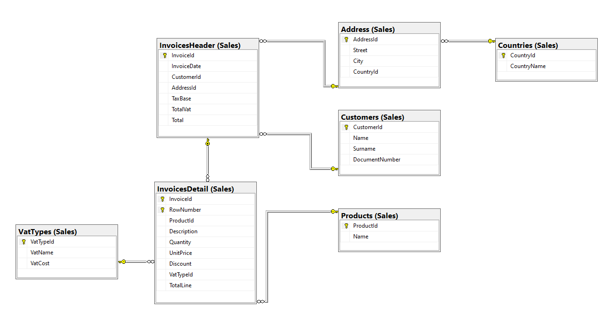

# Formación SQL

## Collation
Las distintas variables que se añaden a los collation de una base de datos y que proporcionan propiedades de distinción entre diferentes elementos relacionados con los campos de tipo caracter, son:

- CS = case-sensitive vs CI = case-insentitive
    - Con CS un texto en mayúsculas no se toma como igual al mismo texto en minúsculas en una comparación; mientras que con CI sí.
- AS = accent-sensitive vs AI = accent-insentitive
    - Con AS se diferencia entre dos textos iguales si uno de ellos tiene algún tipo de acentuación y el otro no.
- KS = Kana type-sensitive
    - Si se incluye, los campos de texto distinguen entre los dos tipos de caracteres japoneses.
- WS = width-sensitive
    - Si se incluye, distingue entre la representación de un caracter de tipo byte o doble-byte (como por ejemplo un 2 y un <sup>2</sup>).
- VSS = variation selector sensitive
    - Si se incluye en las comparaciones de texto se tiene en cuenta las variaciones sobre el valor base.
- BIN = Binary
    - Permite la compatibilidad con el ordenamiento binario.
- BIN2 = Binary-code point
    - Permite el ordenamiento y la comparacion para datos Unicode.
- UTF8
    - Especifica que puede usarse UTF-8 para los tipos compatibles.


## Tipos de datos

### Numéricos exactos

| Tipo de dato | Rango mínimo | Rango máximo | Tamaño | Uso                                                    |
|------------|-------------------|-------------------|---------|------------------------------------------------------------|
| Bit        | 0                 | 1                 | 1 byte  | Campo binario                    |
| Tinyint    | 0                 | 255               | 1 byte  | Números enteros hasta 255   |
| Smallint   | -2^15 (-32,768)   | 2^15-1 (32,767)   | 2 bytes | Cualquier entero dentro del rango, aumenta la capacidad sobre Tinyint |
| Int        | −2^31 (−2,147,483,648) | 2^31−1 (−2,147,483,647) | 4 bytes | Cualquier entero dentro del rango, aumenta la capacidad sobre Smallint |
| Bigint     | −2^63 (−9,223,372,036,854,775,808) | 2^63−1 (−9,223,372,036,854,775,807) | 8 bytes | Cualquier entero dentro del rango, aumenta la capacidad sobre Int |
| Decimal    | −10^38+1          | 10^381−1          | Depende de la precisión, entre 5 bytes y 17 bytes | Cualquier valor decimal dentro del rango y con el tamaño especificado en la definición | 
| Numeric    | −10^38+1          | 10^381−1          | Depende de la precisión, entre 5 bytes y 17 bytes | Cualquier valor decimal dentro del rango y con el tamaño especificado en la definición. Es idéntico al tipo Decimal | 
| Smallmoney | -214,478.3648     | +214,478.3647     | 4 bytes | Valores monetarios dentro del rango |
| Money      | −922,337,203,685,477.5808 | +922,337,203,685,477.5807 | 8 bytes | Valores monetarios dentro del rango, aumenta la capacidad sobre Smallmoney |


### Númericos aproximativos

| Tipo de dato | Rango mínimo | Rango máximo | Tamaño | Uso                                                    |
|------------|-------------------|-------------------|---------|------------------------------------------------------------|
| Real        | −3.40E+38                | 3.40E+38                | 4 bytes  | Números aproximativos dentro del rango                  |
| Float(n)    | −1.79E+308         | 1.79E+308               | Depende del valor de (n). Entre 4 y 8 bytes | Números aproximativos dentro del rango. Float(24) es igual a Real   |


### Tipos fecha y hora

| Tipo de dato | Rango mínimo | Rango máximo | Tamaño | Uso                                                    |
|----------------|-------------------|-------------------|---------|----------------------------------------------------------------------|
| Date           | 01/01/0001       | 31/12/9999       | 3 bytes | Almacena solo fechas |
| Datetime       | 01/01/1753 00:00:00      | 31/12/9999 23:59:59   | 8 bytes | Almacen fechas con horas con precision de .000, .003 o .007 segundos |
| Datetime2      | 01/01/0001 00:00:00 | 31/12/9999  23:59:59.9999999 | 6-8 bytes (depende de la precisión) | Almacen fechas con horas con precision entre 0 y 7 dígitos (100ns). Mejora en precision y uso de almacenamiento a Datetime|
| Datetimeoffset | 01/01/0001 00:00:00 | 31/12/9999 23:59:59.9999999 | 10 bytes | Similar a Datetime2 pero incluyendo el offset de la zona horaria (-14 a +14 horas) |
| Smalldatetime  | 01/01/1900 00:00:00 | 06/06/2079 23:59:59 | 4 bytes | Almacena fechas con horas dentro del rango con precisión de 1 minuto. |
| Time           | 00:00:00.0000000  | 23:59:59.9999999 | 5 bytes | Almacena solo horas con precisión de 100ns |


### Tipos de caracteres

| Tipo de dato | Rango mínimo | Rango máximo | Tamaño | Uso                                                    |
|-------------|----------------|---------------|---------------------------|------------------------------------------------------------------------------------------------------------------|
| Char(n)     | 0 caracteres   | 8000 caracteres | n bytes                   | Almacena caracteres de tamaño fijo (N)                        |
| Varchar(n)  | 0 caracteres   | 8000 caracteres | n bytes + 2 bytes         | Almacena caracteres de tamaño variable. Varchar(max) permite hasta 2^31 chars  |                   |
| Text        | 0 chars        | 2,147,483,647 chars | n bytes + 4 bytes      | Almacena tambien caracteres de tamaño variable. Se recomienda no usarlo.


### Tipos de caracteres Unicode

| Tipo de dato | Rango mínimo | Rango máximo | Tamaño | Uso                                                    |
|-------------|----------------|---------------|---------------------------|------------------------------------------------------------------------------------------------------------------|
| Nchar       | 0 caracteres | 4000 caracteres      | 2 veces n bytes          | Almacena caracteres de tamaño fijo (N) basados en Unicode                       |        |
| Nvarchar    | 0 chars       | 4000 chars           | 2 veces n bytes          | Almacena caracteres de tamaño variable basados en Unicode  |  
| Ntext       | 0 chars       | 1,073,741,823 chars  | 2 veces el tamaño del string | Almacena tambien caracteres de tamaño variable basados en Unicode. Se recomienda no usarlo.


### Tipos binarios

| Tipo de dato | Rango mínimo | Rango máximo | Tamaño | Uso                                                    |
|-------------|----------------|---------------|---------------------------|------------------------------------------------------------------------------------------------------------------|
| Binary    | 0 bytes     | 8000 bytes     | N bytes                              | Almacena un string binario de tamaño fijo        |
| Varbinary | 0 bytes     | 8000 bytes     | El tamaño del string + 2 bytes | Almacena un string binario de tamaño fijo o variable                                                      |
| Image     | 0 bytes     | 2,147,483,647 bytes |                                      | Almacena una imagen en formato binario. Se recomienda no usarlo |


### Otros tipos

| Tipo de dato | Uso |                                                    
|-----------|---------|
| Rowversion | Almacena un valor binario único autogenrado a nivel de base de datos |
| Hierarchyid | Representa la posición dentro de una jerarquía |
| Uniqueidentifier | Genera un GUID de 16 bytes |
| XML | Almacena XML en una columna SQL |
| Geometry | Almacena datos en sistema de coordenadas plano |
| Geography | Almacena datos de tipo espacial, como valores GPS  |


### Uniqueidentifier vs Int autonumérico (Identity)

La decisión del uso de Uniqueidentifier o Identity como valor identificativo de cada fila de una tabla de base de datos se debe realizar en base a las siguientes consideraciones:
- Almacenamiento:
    - Un int requiere solo 4 bytes por los 16 del GUID que genera Uniqueidentifier
- Eficiencia en índices:
    - Con un int utilizar índices es más eficiente por el tamaño de los datos almacenados
- Dependencia de base de datos:
    - Los GUID no dependen del resto de registros de la propia tabla ni de la base de datos, por lo que son más fáciles de generar y de portar entre distintos sistemas
- Mantenimiento:
    - Los GUID son más complejos de mantener al no ser previsibles como el int autonumérico y porque son más díficiles de leer.


### Valores por defecto

El uso de valores por defecto en las columnas de una tabla es apropiado en los casos en que se pueda determinar de forma clara un único valor base para todos los registros que se puedan crear; en caso de que no se determine en la sentencia de inserción específicamente. Por ejemplo, una columna datetime que almacene la fecha de modificación del registro y su defecto sea la función GETDATE(), o campos enterosen los que se precise que, en caso de no indicar otra cosa en la creación del registro, se almacene un 0 en lugar de un nulo.

Algunos ejemplos de valores por defecto son:

```sql
CREATE TABLE Users (
    Id INT PRIMARY KEY,
    Name VARCHAR(50),
    RegisterDate DATETIME DEFAULT GETDATE()
    Estado VARCHAR(20) DEFAULT 'Activo'
    Wage DECIMAL(10, 2) DEFAULT 0.00;
);
```

### Valores nulos

La utilización de valores nulos en columnas de tablas de base de datos permite una mayor flexibilidad en la gestión de datos ya que no obligan a la inclusión de valores concretos y puede reducir espacio en el uso de la misma, pero a su vez aumenta la probabilidad de errores lógicos en las consultas y aumento de complejidad en la realización de las mismas por tener que contemplar esa opción además de la propia del tipo de dato de la columna.


### Diagrama de base de datos

El diagrama de las bases de datos de smcdb1 es el siguiente:




### Campos clave compuestos

El uso de claves compuestas por varias columnas es útil en las ocasiones en las que sea complicado encontrar un campo único en esa tabla, bien sea por la falta de entidad de la propia tabla o porque se trate de, por ejemplo, una tabla que genere una relación N a N entre otras dos tablas. En estos casos, es útil usar las como clave primaria las dos claves primarias de las tablas asociadas o bien, como en el caso de InvoicesDetail, la clave primaria de su cabecera, InvoicesHeader y el número de línea único para cada factura, pero no a nivel general de la tabla.


### Campos calculados vs Triggers

El uso de campos calculados es más simple para casos de operaciones simples dentro de una misma tabla, que no impliquen una lógica compleja. Usándolos, el rendimiento no se ve muy afectado y permite una forma fácil de actualizar datos automáticamente.

Por su parte, los triggers permiten mucha más flexibilidad a la hora de crear operaciones complejas que incluso puedan utilizar campos de diversas tablas o actualizar unas tablas cuando se producen cambios en otras. Al ser operaciones que deben crearse fueras de las tablas, implican más mantenimiento y, en función de su complejidad, pueden perjudicar al rendimiento de las consultas.


### Distintos collation en una misma tabla

Es posible indicar collation diferentes para cambios de texto en una misma tabla con la simple indicación del "collate" en la definición de la columna en cuestión. Las limitaciones principales que tiene esta práctica se basan en la complejidad que suma a cualquier uso posterior de esas columnas en consultas, joins o comparaciones textuales. Además de complejizar la interoperabilidad de la base de datos con otros sistemas o programas que la usen, siendo quizás necesarias transformaciones extra.

